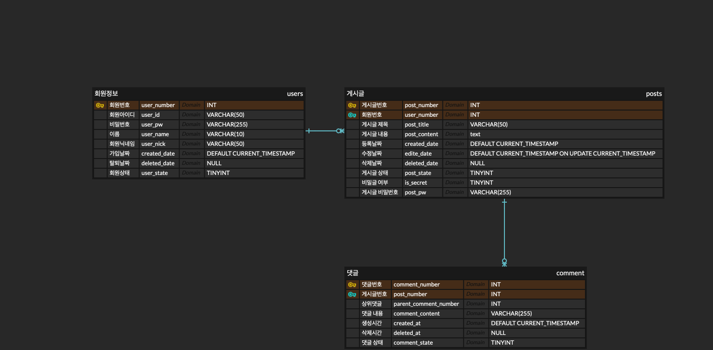
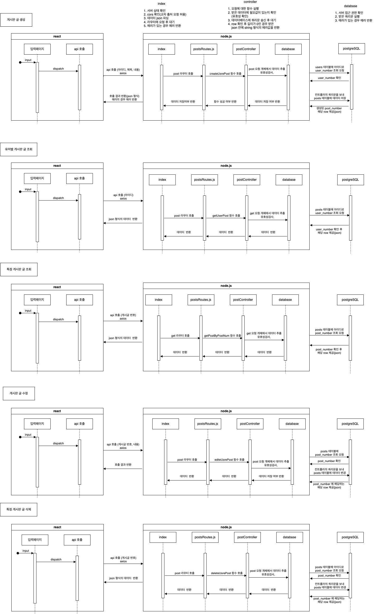

# notice_board

벡엔드 알고리즘 작성 및 데이터베이스 물리구조 제작 연습을 위한 게시판 생성 프로젝트입니다.  
node.js와 postgreSQL을 사용하였습니다.  
본 프로젝트의 기간은 24.11.22 ~ 24.11.27 입니다. 
 
게시판 생성, 조회, 삭제가 가능하며
댓글의 경우 자기 참조 구조를 이용하여 대댓글까지 가능합니다.

# Database Schema

아래는 프로젝트에서 사용된 데이터베이스의 구조입니다:

구조에 맞게 postgreSQL을 제작하였으며 관련 쿼리문은 database 폴더 내부에 있습니다. 
배포시 보안을 좀 더 관리하고자 추가적인 몇가지의 기본 제약들과 환경변수 설정, 일반유저와 개발자의 계정 분리를 통한 권한 배정을 진행하였습니다.  
이와 관련된 내용 또한 해당폴더 내에 sql파일에 정리해 두었습니다. 

# Service Flow

게시판 서비스 대한 흐름은 위와 같습니다.  
댓글에 대한 내용은 추후 업데이트 예정입니다.
